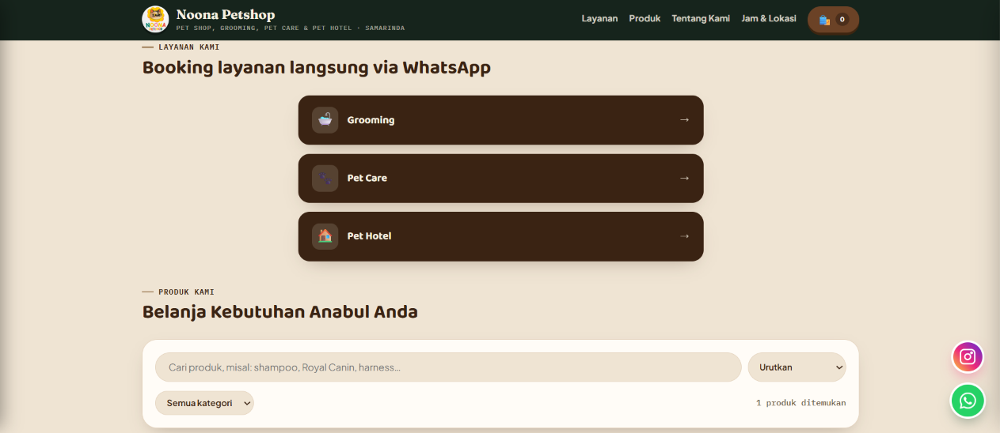

# Noona Petshop — E-Katalog


Website e-katalog dengan tiga area:
- **Publik** (`/`) — pelanggan lihat produk & layanan (harga per varian ukuran), cari/filter produk, masukkan ke keranjang, lalu checkout langsung membuka WhatsApp untuk konfirmasi pesanan. Ada juga tombol WhatsApp mengambang untuk kontak langsung.
- **Admin** (`/admin`) — satu akun admin untuk kelola produk (dengan toggle tersedia/habis), layanan (dengan varian harga), dan pesanan masuk.
- **Database** — SQLite sungguhan (`better-sqlite3`).

## Menjalankan di lokal

```bash
npm install
cp .env.example .env      # kalau belum ada .env
npm start                 # jalan di http://localhost:3000
```

Saat pertama kali dijalankan, server otomatis membuat `data/noona.db` dan mengisi (seed):
- 1 akun admin
- 4 layanan grooming (sesuai price list resmi Noona Petshop)
- **Produk kosong** — sengaja tidak ada data contoh, produk ditambahkan sendiri lewat dashboard admin.

Login admin default (**ganti segera setelah login pertama**):
- URL: `http://localhost:3000/admin/login`
- Username: `admin`
- Password: `noona123`

Nomor WhatsApp toko diisi di `.env.example` sebagai `WA_NUMBER` (`628156587891`). Ganti sesuai kebutuhan.

> Kalau setup ulang dari database lama, hapus dulu `data/noona.db`, `data/noona.db-wal`, dan `data/noona.db-shm` sebelum `npm start`, supaya skema tabel terbaru terbentuk dari awal.

## Fitur utama & alasan desain

**Produk dimulai kosong.** Tidak ada data dummy/contoh yang ter-seed otomatis untuk tabel produk — begitu admin login pertama kali, katalog langsung diisi dengan produk asli sendiri lewat dashboard.

**Layanan dipecah jadi 3 kategori: Grooming, Pet Care, Pet Hotel.** Di halaman publik, pelanggan pilih kategori dulu (lewat rute `/layanan/<kategori>`) baru melihat daftar layanan pada kategori itu sebagai kartu.

**Grooming** — 4 layanan hasil seed dari price list resmi, harga per ukuran (S/M/L/XL/XXL):
- **Basic Grooming** — mandi, potong kuku, bersihkan telinga, parfum
- **Treatment Grooming** — mandi shampo khusus jamur & kutu, potong kuku, bersihkan telinga, parfum
- **Luxury Grooming** — mandi shampo mewah, potong kuku, rapikan bulu kaki, bersihkan telinga, parfum
- **Other Treatment** — item à la carte: Lion Cut, Paw/Butt Trimming, Nail Trimming, Ear Cleaning, Matted Shaved

**Pet Care** — 6 layanan tanpa daftar harga tetap (harganya disesuaikan dengan kondisi anabul saat konsultasi/booking, ada catatan "*Harga disesuaikan dengan treatment yang diberikan" di halaman kategori ini):
- **Check Up** — pemeriksaan kondisi kesehatan anabul secara menyeluruh
- **Konsultasi** — konsultasi mengenai kondisi dan kebutuhan kesehatan anabul
- **Vaksin** — layanan vaksinasi
- **Home Visit** — pemeriksaan & perawatan lewat kunjungan ke rumah
- **Steril Jantan & Betina** — tindakan sterilisasi anabul jantan/betina
- **Minor Surgery** — tindakan bedah ringan sesuai kondisi anabul

**Pet Hotel** — 2 layanan dengan harga per hari, ditampilkan sebagai kartu horizontal bertumpuk (beda dari grid vertikal Grooming & Pet Care):
- **Pet Hotel** — Rp 40.000/hari (include pasir) atau Rp 45.000/hari (include pasir & pakan standar); ada syarat & ketentuan di deskripsinya (anabul sehat, bebas jamur/kutu, sudah vaksin minimal pertama + buku vaksin)
- **Rawat Inap** — Rp 55.000/hari, untuk masa pemulihan

Kalau suatu kategori/layanan belum ada isinya sama sekali, halaman publik otomatis menampilkan "Segera hadir" — jadi ketiga kategori ini aman ditambah atau dikosongkan lagi kapan pun lewat dashboard admin tanpa perlu ubah kode.

Jam operasional (Pet Shop & Pet Clinic 09.00–21.00, Pet Grooming 09.00–16.00, tutup tiap Kamis) ditampilkan sebagai banner kecil di halaman publik. Di dashboard admin, form layanan punya **editor varian dinamis** — tombol "+ Tambah varian" untuk menambah baris (nama varian + harga), dan tombol ✕ di tiap baris untuk menghapusnya. Bisa dipakai untuk varian ukuran (seperti grooming) maupun daftar item flat (seperti Other Treatment, tiap item jadi satu "varian").

**Stok produk pakai toggle, bukan angka.** Kolom "Stok" di tabel & form produk berupa saklar **Tersedia / Habis** yang langsung tersimpan begitu diklik (tidak perlu tombol "Simpan" terpisah). Cocok untuk toko yang tidak melacak jumlah stok persis, cuma perlu tahu ada/tidaknya barang.

**Tombol WhatsApp mengambang.** Pojok kanan bawah tiap halaman publik ada tombol bulat yang langsung membuka chat WhatsApp ke `WA_NUMBER` dengan pesan pembuka umum — terpisah dari alur konfirmasi pesanan/booking layanan.

**Status pesanan dibuat sesederhana mungkin**, tiga kategori saja:
- `menunggu_pembayaran` — **Menunggu Pembayaran** (status awal begitu pelanggan checkout)
- `dibayar` — **Telah Dibayar**
- `dibatalkan` — **Dibatalkan**

Admin mengubah status ini manual di tab "Pesanan" pada dashboard setelah mengecek pembayaran masuk (lihat "Alur belanja" di bawah untuk alasan kenapa manual, bukan otomatis).

**Pesan konfirmasi pesanan pakai teks polos**, tanpa emoji, biar terlihat profesional saat dikirim ke pelanggan lewat WhatsApp.

## Alur belanja: keranjang → checkout → WhatsApp

1. Pelanggan tambah produk ke **keranjang** (`localStorage` browser, jadi tidak hilang saat refresh).
2. Klik **"Pesan Sekarang"** → sistem membuat **pesanan** lewat `POST /api/orders`. Harga & nama produk **dihitung ulang dari database**, bukan dari data yang dikirim browser. Status pesanan otomatis **"Menunggu Pembayaran"**.
3. Browser langsung membuka chat WhatsApp ke `WA_NUMBER` dengan pesan berisi nomor order, daftar item, dan total, sekaligus minta info ketersediaan & cara pembayaran. Keranjang otomatis dikosongkan.
4. Admin melihat pesanan ini di tab **"Pesanan"**, mencocokkan dengan chat WhatsApp & bukti transfer, lalu ubah status jadi **Telah Dibayar** atau **Dibatalkan**.

Tidak ada QR code atau payment gateway di alur ini — pembayaran & konfirmasinya sepenuhnya lewat percakapan WhatsApp manual dengan admin. Ketersediaan produk (toggle tersedia/habis) juga **tidak berubah otomatis** saat ada pesanan masuk — itu tetap dikontrol manual admin di tab Produk.

Layanan (grooming) tetap booking langsung via WhatsApp (bukan lewat keranjang), karena sifatnya jadwal kunjungan, bukan barang yang bisa dihitung jumlahnya.

## Autentikasi admin

Akun tersimpan di tabel `users` pada `data/noona.db`, session dipegang di server (cookie `httpOnly`), middleware `requireAuth` mengunci halaman `/admin/dashboard` & semua API tulis.
- **Ganti password**: ikon 🔑 di dashboard, atau `node scripts/reset-admin-password.js password-baru`

## Struktur proyek

```
server.js                       Entry point Express + session + routing
middleware/auth.js               requireAuth — kunci semua route/API admin
routes/auth.routes.js             login, logout, cek status login, ganti password
routes/products.routes.js          GET publik + POST/PUT/DELETE admin-only + toggle availability + upload foto
routes/services.routes.js           GET publik (bisa filter ?category=) + POST/PUT/DELETE admin-only (tiers)
routes/orders.routes.js              POST publik (buat pesanan) + GET/PATCH admin-only (status)
db/connection.js                      Skema tabel + seed admin & layanan (produk sengaja kosong)
db/products.js                         Query produk, termasuk toggle available
db/services.js                          Query layanan dengan tiers (JSON per baris) + kategori (grooming/pet-care/pet-hotel)
db/users.js                              Query akun admin
db/orders.js                              Query pesanan, hitung ulang harga dari DB
scripts/hash-password.js                  Utilitas cetak hash password (untuk .env)
scripts/reset-admin-password.js            Reset password admin langsung di database
public/                                     Frontend PUBLIK (index.html, css, js, logo, uploads foto)
admin/                                       Frontend ADMIN (login.html, dashboard.html, css, js)
```

## Catatan & batasan penting

- **Session di memori server** — restart server = semua logout. Untuk production, pakai session store persisten (Redis/`connect-sqlite3`).
- Sebelum online: ganti `SESSION_SECRET`, aktifkan `cookie.secure = true` (butuh HTTPS), ganti password admin default.
- Gambar produk pakai ikon emoji sebagai default; upload foto asli lewat form produk (JPG/PNG/WEBP, maks 3MB).
- `data/noona.db` tidak ikut ter-zip/ter-commit (`.gitignore`) — tiap setup baru mulai dari database kosong (kecuali layanan & admin yang di-seed otomatis).